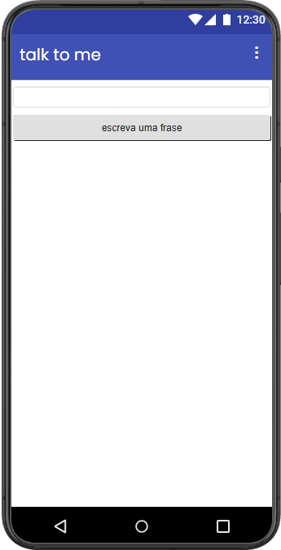

#Projeto 01: Fale Comigo (Talk To Me)

Este foi o meu projeto inicial desenvolvido no projeto de extensão **Elas Programando**. O aplicativo tem uma interface direta que permite ao usuário digitar qualquer frase e, ao clicar no botão, o celular reproduz o texto em formato de áudio.

## Demonstração

##Como testar
Se você estiver em um dispositivo Android, pode baixar e instalar o arquivo `talktome.apk` disponível nesta pasta para testar o aplicativo diretamente no seu celular ou através do MIT AI2 Companion!

##Funcionalidades
* **Entrada de Texto Dinâmica:** Campo para digitar livremente a mensagem que deseja ouvir.
* **Conversão Instantânea:** Botão de ação que dispara o recurso de voz do dispositivo móvel.

##Conceitos de Programação Aprendidos
* **Componente TextBox (Caixa de Texto):** Captura e manipulação de strings (textos) inseridas pelo usuário.
* **Componente TextToSpeech (Texto para Fala):** Introdução ao uso de recursos nativos de acessibilidade do sistema operacional Android.
* **Programação Baseada em Eventos:** Vinculação do evento de clique do botão (`Button.Click`) à execução de uma função com parâmetro.
