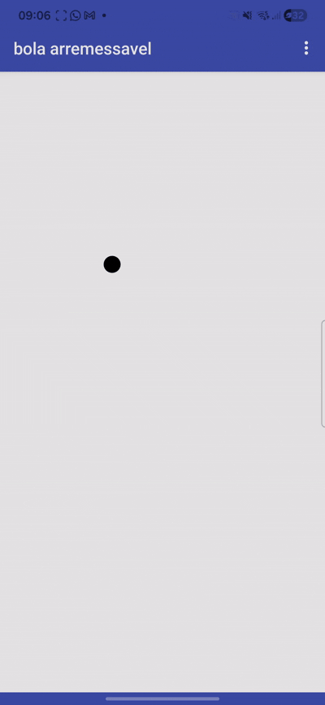

# ⚽ Projeto 02: Bola Saltitante (Ball Bounce)

O **Ball Bounce** é um projeto focado no desenvolvimento de lógica de movimento automático e animações interativas dentro do projeto de extensão **Elas Programando**. O aplicativo simula o movimento de uma bola que rebate nas bordas da tela e interage com o usuário.

## 📱 Demonstração do App

## 🚀 Funcionalidades
* **Movimento Contínuo:** Uma bola que se move sozinha pela tela com velocidade e direção definidas.
* **Detecção de Bordas:** A lógica faz com que a bola identifique o limite da tela e mude sua trajetória ao colidir (efeito de rebote).

## 🧠 Conceitos de Programação Aprendidos
* **Componente Canvas e Sprite (Ball):** Uso de superfícies gráficas e objetos móveis para jogos e animações.
* **Propriedades de Vetores (`Heading` e `Speed`):** Controle de velocidade e direção baseada em ângulos (0° a 360°).
* **Tratamento de Colisões (`EdgeReached`):** Uso de eventos para detectar quando o objeto atinge a borda da tela e aplicação de funções para rebater.
