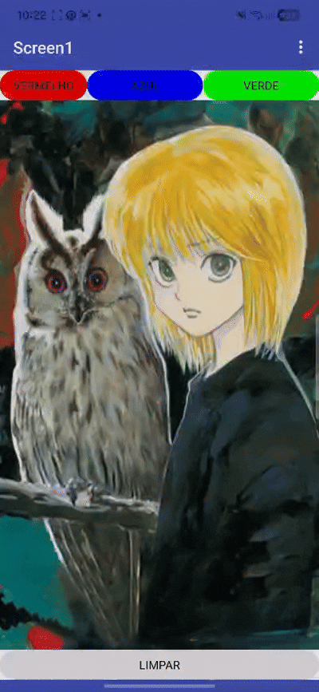

# Projeto 04: Tela de Desenho (Canvas Paint)

Este projeto foi desenvolvido no âmbito do projeto de extensão **Elas Programando**, com foco na manipulação gráfica em tempo real e na utilização de sensores físicos do smartphone. O aplicativo permite que o utilizador faça desenhos livres na tela usando o dedo e interaja com o hardware do telemóvel para gerenciar o Canvas.

## Demonstração do App

## Funcionalidades
* **Desenho Livre:** Criação de linhas fluidas na tela seguindo as coordenadas exatas do toque do utilizador.
* **Apagar por Movimento (Shake to Clear):** Graças ao sensor de movimento do telemóvel, basta sacudir o aparelho para que a tela seja limpa automaticamente, reiniciando o espaço de desenho.

## Conceitos de Programação Aprendidos
* **Componente Canvas (Tela de Pintura):** Criação de superfícies interativas que reconhecem coordenadas cartesianas (Eixos `X` e `Y`).
* **Tratamento de Eventos de Arraste (`Canvas.Dragged`):** Captura contínua da posição do dedo do utilizador para interligar os pontos anterior (`prevX`, `prevY`) e atual (`currentX`, `currentY`) por meio de linhas.
* **Componente AccelerometerSensor (Acelerômetro):** Introdução à leitura de sensores de hardware. Uso do evento `Shaking` (Sacudindo) para disparar a função de limpeza do Canvas.
