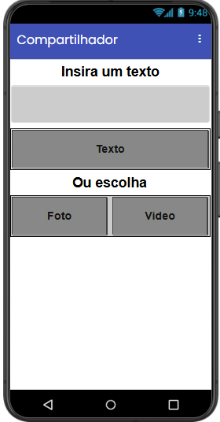
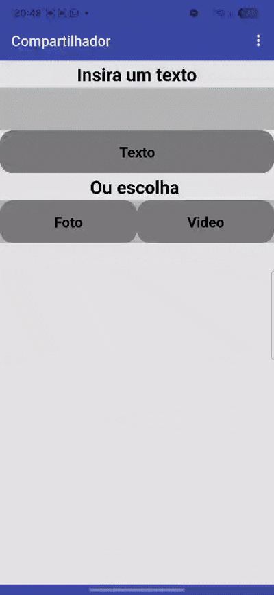
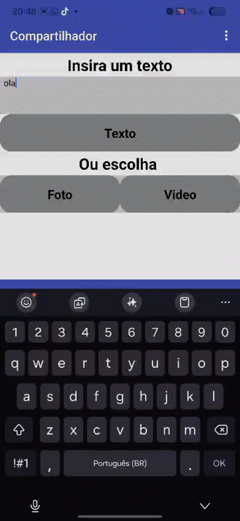
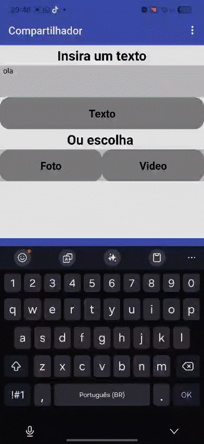

# Projeto 06: Compartilhador Multimédia

Este projeto foi desenvolvido no âmbito do projeto de extensão **Elas Programando**, com o objetivo de explorar a integração do aplicativo com os recursos e sensores nativos do smartphone. O aplicativo permite ao utilizador capturar fotos, gravar vídeos ou introduzir textos personalizados e partilhá-los diretamente através de outras aplicações (como WhatsApp, e-mail ou redes sociais).

## Interface do Aplicativo
Aqui está o design estruturado dentro do MIT App Inventor:

---

## Funcionalidades e Demonstrações

O projeto foi dividido em três recursos principais de interação com o hardware do telemóvel:

### 1. Partilha de Texto
Permite que o utilizador digite qualquer mensagem personalizada e a envie diretamente para outras plataformas utilizando o ecossistema nativo do sistema operativo.

### 2. Captura e Partilha de Foto
Invocação do hardware da câmara fotográfica para registar uma imagem em tempo real e passá-la automaticamente para o menu de envio.

### 3. Gravação e Partilha de Vídeo
Integração com a filmadora nativa do telemóvel para gravar pequenos clipes e disponibilizá-los para partilha imediata.

---

## Conceitos de Programação Aprendidos
* **Uso de Recursos Nativos do Hardware:** Aprendizagem prática sobre como invocar as funções da câmara do telemóvel (`Camera.TakePicture`) e da filmadora (`Camcorder.RecordVideo`).
* **Tratamento de Ficheiros Temporários:** Compreensão de como o MIT App Inventor armazena e passa o caminho da imagem ou vídeo capturado (usando a variável `image` ou `clip`) para outros componentes.
* **Componente Sharing (Compartilhador):** Utilização do componente invisível de partilha para fazer a ponte entre o aplicativo e o ecossistema do smartphone, usando blocos como `Sharing.ShareMessage` e `Sharing.ShareFile`.
