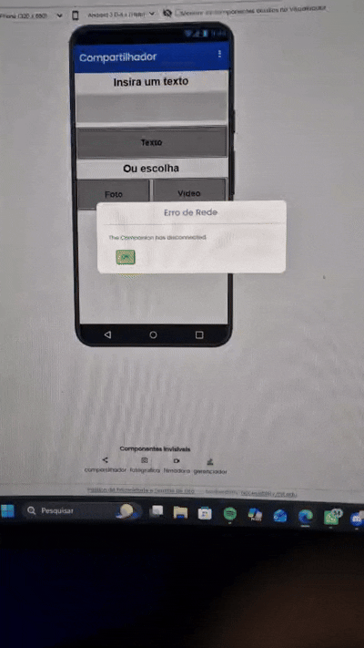

# Projeto 06: Compartilhador 

Este projeto foi desenvolvido no âmbito do projeto de extensão **Elas Programando**, com o objetivo de explorar a integração do aplicativo com os recursos e sensores nativos do smartphone. O aplicativo permite ao utilizador capturar fotos, gravar vídeos ou introduzir textos personalizados e partilhá-los diretamente através de outras aplicações (como WhatsApp, e-mail ou redes sociais).

## Demonstração do App

## Funcionalidades
* **Captura de Imagem e Vídeo:** Integração direta com a câmara fotográfica e a filmadora nativas do telemóvel.
* **Envio de Mensagens Personalizadas:** Campo de texto estruturado para o utilizador redigir mensagens para partilha.
* **Componente de Partilha Avançada:** Acionamento do menu nativo do sistema operativo para enviar os ficheiros e textos escolhidos.

## Conceitos de Programação Aprendidos
* **Uso de Recursos Nativos do Hardware:** Aprendizagem prática sobre como invocar as funções da câmara do telemóvel (`Camera.TakePicture`) e da filmadora (`Camcorder.RecordVideo`).
* **Tratamento de Ficheiros Temporários:** Compreensão de como o MIT App Inventor armazena e passa o caminho da imagem ou vídeo capturado (usando a variável `image` ou `clip`) para outros componentes.
* **Componente Sharing (Compartilhador):** Utilização do componente invisível de partilha para fazer a ponte entre o aplicativo e o ecossistema do smartphone, usando blocos como `Sharing.ShareMessage` e `Sharing.ShareFile`.
